<picture>
  <source media="(prefers-color-scheme: dark)" srcset="./assets/banner-dark.svg">
  
</picture>

  
  
  
  
  
  

### About

I'm show, a developer in Shanghai working at TikTok. I build almost everything in Swift: Mac apps, command-line tools, and lately the plumbing that lets AI agents do real work on real computers, safely. I like opening things up to see how they work, then making the tool I wish existed.

- :artificial_satellite: Building [**Computer MCP**](https://github.com/computer-mcp/computer-mcp), a governed local capability gateway that lets ChatGPT and other MCP clients use your local tools.
- :package: Maintaining [**swift-library**](https://github.com/swift-library), focused Swift packages and command-line tools.
- :jigsaw: Shipping [**skill-cli**](https://github.com/skill-cli/cli), a native CLI for installing and watching agent skills.

### Featured

<table>
  <tr>
    <td width="50%" valign="top">
      <a href="https://github.com/showxu/objc4"><b>objc4</b></a>&nbsp;
      
       
      A buildable and debuggable Objective-C runtime (objc4-818.2).
       
      <code>runtime</code>
    </td>
    <td width="50%" valign="top">
      <a href="https://github.com/showxu/cartools"><b>cartools</b></a>&nbsp;
      
       
      Toolkit for compiled asset catalogs (<code>.car</code> files).
       
      <code>Swift</code>
    </td>
  </tr>
  <tr>
    <td width="50%" valign="top">
      <a href="https://github.com/computer-mcp/computer-mcp"><b>computer-mcp</b></a>&nbsp;
      
       
      Let ChatGPT use your local tools through a governed MCP gateway.
       
      <code>Swift</code> <code>MCP</code>
    </td>
    <td width="50%" valign="top">
      <a href="https://github.com/swift-library/swift-codex"><b>swift-codex</b></a>&nbsp;
      
       
      Swift-native interfaces backed by Codex CLI, MCP and AppServer protocols.
       
      <code>Swift</code> <code>Codex</code>
    </td>
  </tr>
  <tr>
    <td width="50%" valign="top">
      <a href="https://github.com/swift-library/swift-benchmark"><b>swift-benchmark</b></a>&nbsp;
      
       
      Runtime instrumentation, repeatable benchmarks and structured reports for Swift.
       
      <code>Swift</code>
    </td>
    <td width="50%" valign="top">
      <a href="https://github.com/computer-mcp/apple-cli"><b>apple-cli</b></a>&nbsp;
      
       
      A local macOS CLI and MCP server for Apple apps.
       
      <code>Swift</code> <code>MCP</code>
    </td>
  </tr>
</table>

### Toolbox

  
  
  
  
  
  

### Recent releases

<!-- recent-releases:start -->
- [swift-benchmark 0.1.1](https://github.com/swift-library/swift-benchmark/releases/tag/v0.1.1) - 2026-10-04
- [swift-sh 0.1.1](https://github.com/swift-library/swift-sh/releases/tag/v0.1.1) - 2026-10-04
- [swift-semver 0.1.0](https://github.com/swift-library/swift-semver/releases/tag/v0.1.0) - 2026-10-04
- [swift-data-writable 0.1.0](https://github.com/swift-library/swift-data-writable/releases/tag/v0.1.0) - 2026-10-03
- [computer-mcp 1.3.2](https://github.com/computer-mcp/computer-mcp/releases/tag/v1.3.2) - 2026-10-02
- [plugin-codex 0.3.0](https://github.com/computer-mcp/plugin-codex/releases/tag/v0.3.0) - 2026-09-29
<!-- recent-releases:end -->

More releases on [swift-library](https://github.com/swift-library) and [computer-mcp](https://github.com/computer-mcp).

### Activity

  <picture>
    <source media="(prefers-color-scheme: dark)" srcset="https://raw.githubusercontent.com/showxu/showxu/output/stats-dark.svg">
    
  </picture>
  <picture>
    <source media="(prefers-color-scheme: dark)" srcset="https://raw.githubusercontent.com/showxu/showxu/output/streak-dark.svg">
    
  </picture>

<picture>
  <source media="(prefers-color-scheme: dark)" srcset="https://raw.githubusercontent.com/showxu/showxu/output/github-contribution-grid-snake-dark.svg">
  
</picture>
